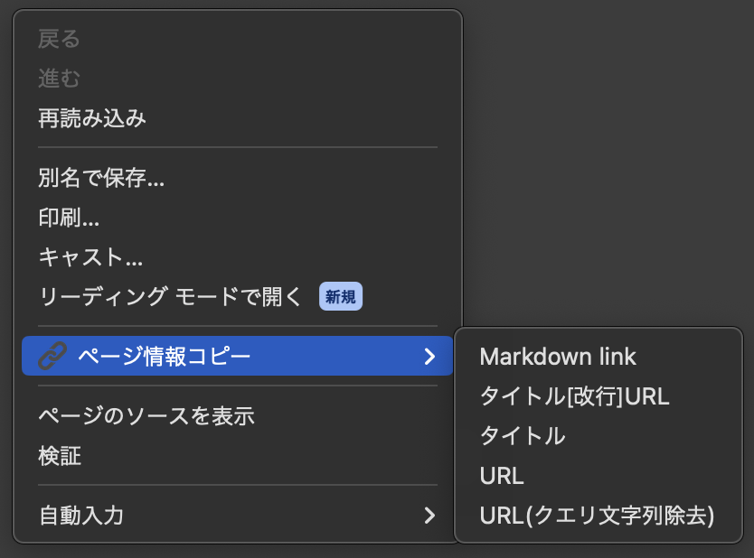

# WebPage Clipboard Tool

## 概要

 WebPage Clipboard Toolは、現在のページのタイトルとURLをさまざまな形式でクリップボードにコピーするためのChrome拡張機能です。  


## 機能

- ページのタイトルとURLをMarkdown形式([タイトル](URL))でコピー
- ページのタイトルとURLを改行で区切ってコピー
- ページのタイトルのみをコピー
- URLのみをコピー
- URLのみをクエリ文字列を除去してコピー

## インストール

1. リポジトリをクローンします:
    ```bash
    git clone https://github.com/foresukecom/webpage-clipboard-tool.git
    ```

2. Chromeを開き、[chrome://extensions/](chrome://extensions/)にアクセスします。

3. 右上の「デベロッパーモード」を有効にします。

4. 「パッケージ化されていない拡張機能を読み込む」をクリックし、クローンしたリポジトリのディレクトリを選択します。

## スクリーンショット

